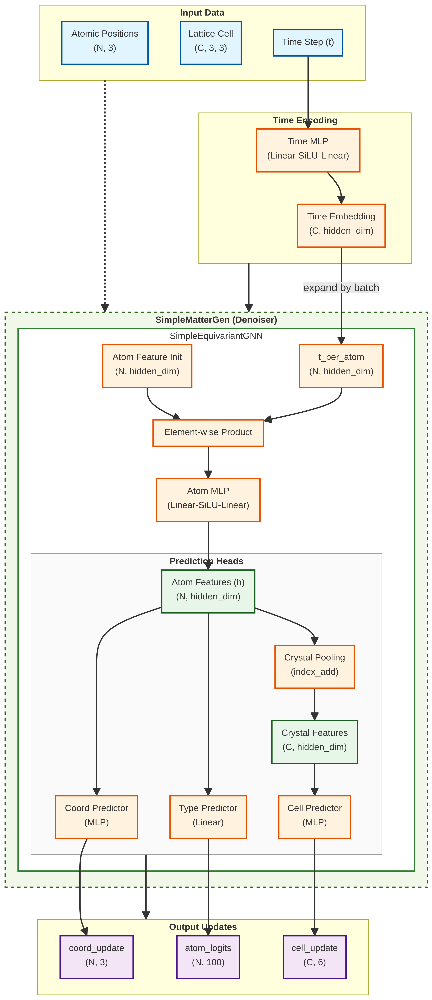
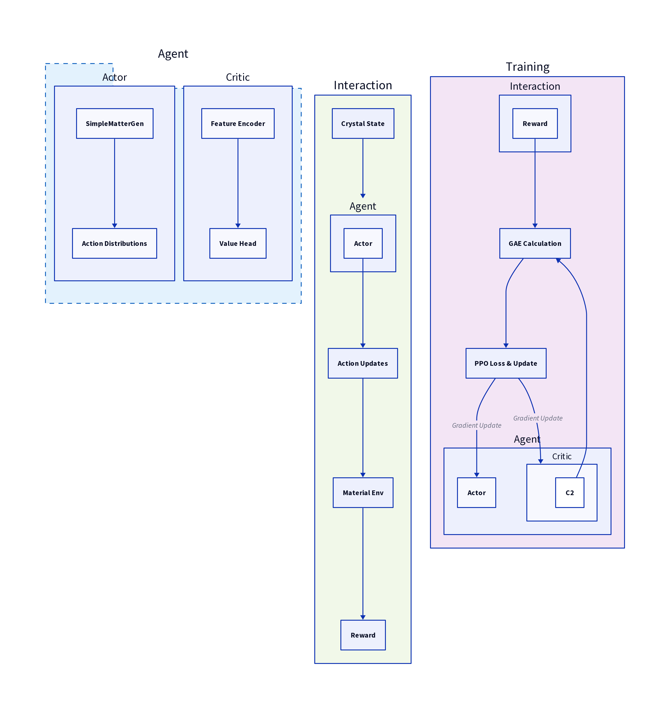
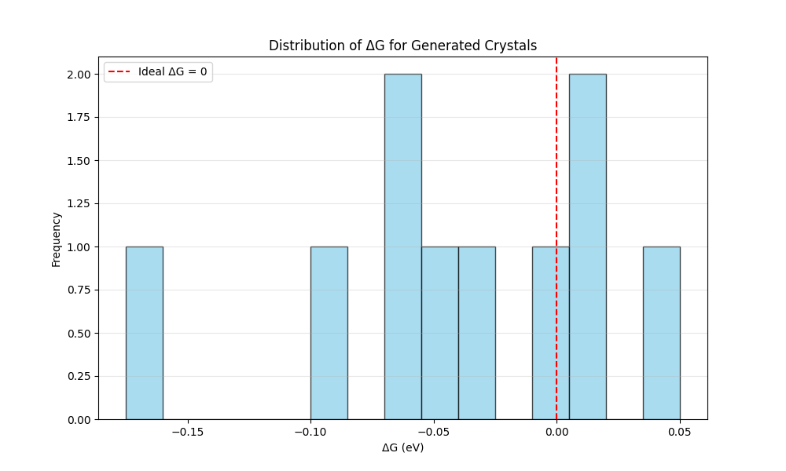
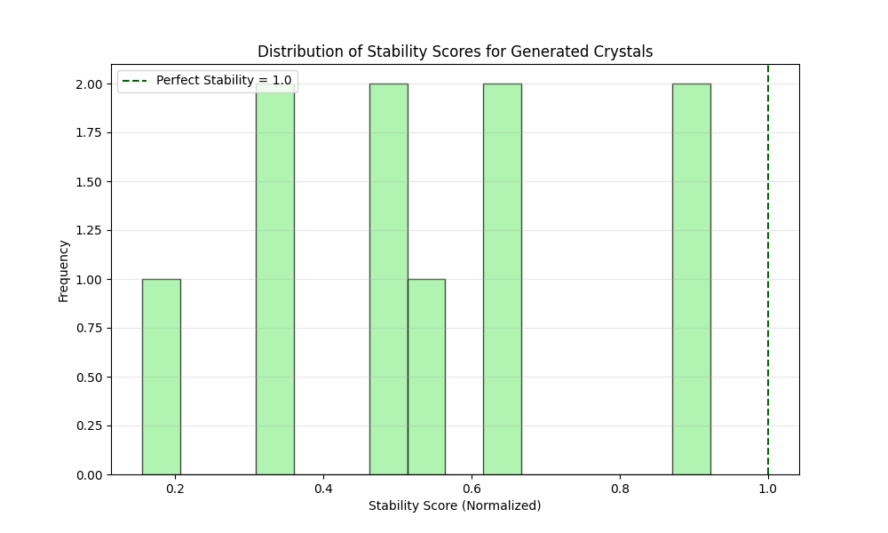
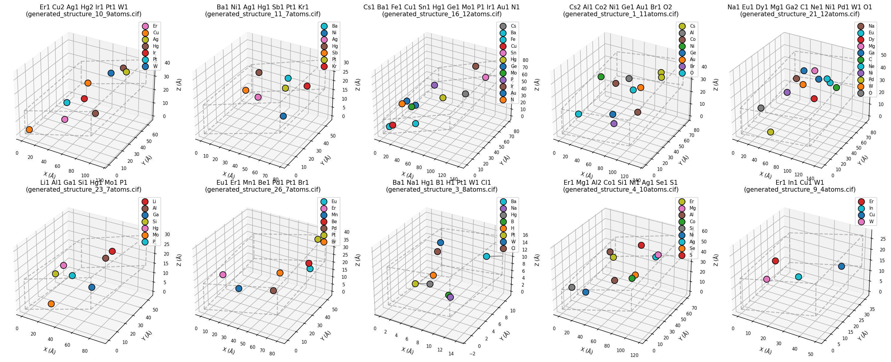

# 文件说明
projects
- data 训练数据
- dataset
    material_dataset 构建训练数据集
- generated_cifs 存放生成的文件
- last_ten_structure 存放筛选后的十个文件
- models 存放模型以及权重文件
    diffusion_model.py
    optimization.py
    structure_generator.py
- results
    generated_structure.png
    her_performance.png
    loss_curve_png
    rl_loss_curve.png
    stability_curve.png
- utils
    geo_utils.py 性能评估代码
    vis.py 绘图代码
- cif_filter.py 选择deltaG不为NaN的文件
- data_utils.py 训练数据格式类
- generate_stable_materials.py 来自baseline仓库，评估材料性能
- preprocess.py 训练数据中间件
- test.py 模型生成文件
- train.py 模型训练文件
- last_eval 评估文件夹下cif文件的三个重要属性（ΔG，稳定性，可合成性）

# 扩散模型架构

# 优化器架构

# 架构流程详述

## 输入与编码阶段：
模型首先接收包含 $N$ 个原子的三维坐标和 $C$ 个晶体的晶格信息。与此同时，时间步 $t$ 通过一个由线性层和 SiLU 激活函数组成的 Time MLP 进行编码。产生的 Time Embedding 是晶体级别的全局特征，它随后被扩展并注入到每个原子的初始特征中，确保模型能够感知当前的去噪阶段。

## 等变特征学习阶段：
在核心的 SimpleEquivariantGNN 模块内，原子初始特征与时间嵌入通过逐元素乘积进行融合。随后，Atom MLP 对融合后的特征进行非线性变换，提取深层结构特征 $h$。这一过程模拟了复杂 GNN 中的消息传递机制，为后续的预测任务奠定了物理基础。

## 多任务预测头：
预测层的设计体现了多尺度建模的思想。模型不仅在原子尺度上通过 Coord Predictor 和 Type Predictor 预测位置偏移和元素种类，还通过 Crystal Pooling（采用 index_add 聚合）将信息提升至晶体尺度。Cell Predictor 最终利用这些聚合特征预测 6 个关键的晶格参数变化量，从而实现对宏观晶体形状的精确控制。

# ΔG性能图

# 稳定性图

# 材料结构图

# 创新点说明
## 1.数据来源：
使用代码获取高质量数据：高稳定性，高活性
## 2.采用强化学习：
以ΔG以及稳定性为指标，微调扩散模型

关键公式
ΔG = ΔH - TΔS​

# 新旧模型效果对比
新
==============================
综合评估统计 (样本数: 10):
1. 平均合成性评分: 0.5350
2. 平均 Delta G (eV): -0.0410
3. 平均稳定性得分: 0.6072
==============================

旧
==============================
综合评估统计 (样本数: 5):
1. 平均合成性评分: 0.4800
2. 平均 Delta G (eV): -0.1500
3. 平均稳定性得分: 0.5416
==============================

总对比

| Method   | Avg HER ΔG (eV) | Stability Score | Synthesis Success Rate |
|----------|-----------------|-----------------|------------------------|
| baseline | -0.1500 eV      | 0.5416          | 0.4800                 |
| Ours     | -0.0410 eV      | 0.6072          | 0.5350                 |